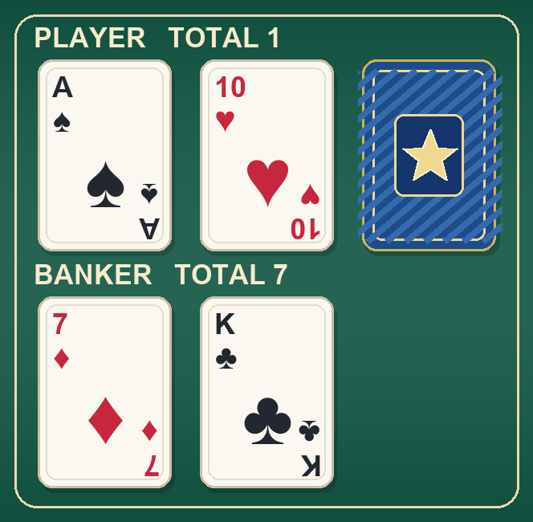

# Discord 社群遊戲機器人

以 Python 與 discord.py 製作的繁體中文 Discord Bot，整合 **8 種小遊戲、虛擬代幣與銀行、道具商店、虛擬投資，以及回合制 RPG**。操作以 `/` 斜線指令、按鈕與選單為主。

這是個人專案的公開整理版，開發過程使用 AI 協作。適合作為互動機器人、非同步事件與遊戲狀態管理的作品展示。代幣與投資均為遊戲用途，不涉及真實金流或券商下單。

## 下載後可以直接用嗎？

**需要先建立自己的 Discord Bot 並填入 Token。GitHub 只提供程式，不提供共用機器人帳號或代管服務。**

| 項目 | 是否必須自行設定 | 說明 |
|---|---|---|
| Python 與套件 | 是 | Python 3.10 以上，依下方步驟安裝 |
| Discord Application／Bot | 是 | 在 Discord Developer Portal 建立自己的應用 |
| `DISCORD_BOT_TOKEN` | 是 | 填入自己的 Bot Token，不能用 Client Secret 或使用者帳號 Token |
| 將 Bot 邀請進伺服器 | 是 | 需要有管理該伺服器、安裝應用的權限 |
| `DISCORD_OWNER_IDS` | 選用 | 管理者的 Discord 使用者 ID；空白會停用擁有者專用指令 |
| 資料庫伺服器 | 不需要 | 執行後自動建立本機 `data.json`，不附任何原玩家存檔 |
| 額外行情 API Key | 不需要 | 虛擬投資使用 Yahoo Finance HTTP 端點；第三方端點可能限流或失效 |
| 持續上線的主機 | 若要全天使用則需要 | 本機睡眠、關機或程式停止後，Bot 就不能回覆 |

## 功能與指令

### 虛擬代幣、銀行與道具

| 指令 | 功能 |
|---|---|
| `/claim` | 台北時間每小時 00／15／30／45 分刷新；每次 50，每日最多 8 次 |
| `/daily` | 台北時間每天午夜刷新；每日 200，另有 10% 機率獲得一張道具券 |
| `/balance`、`/leaderboard` | 查看餘額、戰績與排行榜 |
| `/give` | 玩家間轉帳 |
| `/bank info`、`deposit`、`withdraw` | 存款確認、提款鎖定與週期利息 |
| `/shop list`、`buy`、`inventory` | 購買及查看保險券、拆彈券、加倍券 |

預設新玩家餘額為 **1,000**。簽到加領幣每天最多取得 **600**，更多資源可透過 RPG 挑戰取得。銀行每 4 小時計算 **0.05%** 遊戲利息，只對前 **10,000** 存款計息，每期向下取整、最多 5，直接發到錢包；每次存款重新鎖定 24 小時。

金額與利率集中在 `config.py`；RPG 副本獎勵位於 `rpg_data.py`。`/claim` 的 15 分鐘分段目前寫在 `cogs/economy.py`，不能只改設定中的秒數就改變刷新規則。完整調整理由、賠率與舊存檔處理請見 [經濟平衡說明](BALANCE.md)。

### 8 種互動小遊戲

| 指令 | 玩法 |
|---|---|
| `/baccarat` | 百家樂，押閒／莊／和，附牌面圖片 |
| `/dice` | 三顆骰子押大／小／圍骰，附骰面圖片 |
| `/mines` | 按鈕式踩地雷，選擇風險後逐步揭格 |
| `/balloon` | 打氣球，選擇繼續累積倍率或收取獎勵 |
| `/climb` | 逐層選格的機率爬塔小遊戲 |
| `/crash` | 倍率崩盤與兌現 |
| `/slot` | 拉霸 |
| `/roulette` | 輪盤，押紅／黑／單／雙／指定號碼 |

小遊戲每局下注 **10–500**，含本金與道具最多領回 **5,000**。多數遊戲未計道具、取整與獎金上限的基礎回報為 **96%**；百家樂約 95%–96%，爬塔續爬會再承擔風險。這是大量對局的數學平均，單局可能賺也可能虧；不是固定收入來源。高倍率中獎會受到上限影響，詳細數學與例子見 [平衡說明](BALANCE.md)。

部分遊戲整合道具與再玩一次操作。系統保存待結算下注，並定期檢查逾期待結算項目、退還資金與道具；相同下注只入帳一次。不代表所有斷線或程式錯誤都能完整恢復當局畫面。

### 回合制 RPG

`/rpg` 與上面的 `/climb` 是不同系統：RPG 有角色、職業、屬性、裝備、技能與戰鬥進度。

| 指令 | 功能 |
|---|---|
| `/rpg profile`、`classroll` | 查看角色、抽取／重抽職業 |
| `/rpg train`、`reset_stats` | 配點與重置 |
| `/rpg gacha`、`inventory`、`equip` | 抽裝、背包與穿戴 |
| `/rpg skillgacha`、`skills`、`skill list`、`skillequip` | 技能取得、清單及 6 格技能配置 |
| `/rpg transmute_weapon`、`dismantle`、`materials` | 武器置換、分解與材料管理 |
| `/rpg enhance once`、`enhance auto` | 單次與連續裝備強化 |
| `/rpg craft accessory`、`craft skill` | 消耗素材製作飾品／技能 |
| `/rpg tower`、`boss`、`reward` | 手動回合制爬塔、5 種 Boss 與定時獎勵副本 |
| `/rpg rates` | 查詢抽取機率與能力公式 |

裝備每抽 **100**、技能每抽 **400**、首次職業免費／重抽 **1,000**。金幣副本依簡單／普通／困難／極難給 **600／1,200／2,000／3,000**，金幣與經驗副本共用 12 小時冷卻。一般 RPG 爬塔的戰鬥獎勵、經驗與 Boss 素材機制保留。

### 虛擬投資

- `/invest price`、`/invest search`：台股、美股、BTC 代號與價格查詢。
- `/invest buy`、`/invest sell`：使用遊戲代幣建立與平倉模擬部位，支援多空與 1–3 倍槓桿；單次投入 100–2,000，所有未平倉部位合計本金最多 5,000，重複加倉也計入。
- `/invest portfolio`、`/invest transactions`：查看模擬資產及交易紀錄。
- 行情由 Yahoo Finance 取得，有快取與來源時間；不保證即時、持續可用或完整涵蓋所有商品，不會連接真實交易帳戶。

### 管理

`/help` 顯示常用指令。`/reload`、`/reload_module`、`/sync`、`/clear_guild_commands`、`/reset_cooldown` 僅允許 `DISCORD_OWNER_IDS` 中的使用者執行。**伺服器管理員身分不會自動取得 Bot 擁有者權限。**

`/reload_module` 不保證所有已載入模組的引用都跟著更新；調整設定或資料庫程式後，建議正常停止並重啟 Bot。

## 安裝與啟動

### 1. 下載程式與安裝套件

可使用 Git，或在 GitHub 按 **Code → Download ZIP** 並完整解壓。

Windows PowerShell：

```powershell
git clone https://github.com/rich88970/discord-community-bot.git
cd discord-community-bot
py -3 -m venv .venv
.\.venv\Scripts\python.exe -m pip install -r requirements.txt
Copy-Item .env.example .env
notepad .env
```

macOS／Linux：

```bash
git clone https://github.com/rich88970/discord-community-bot.git
cd discord-community-bot
python3 -m venv .venv
.venv/bin/python -m pip install -r requirements.txt
cp .env.example .env
```

使用文字編輯器打開 `.env`。此檔只需要建立一次；已有設定時不要再用範例覆蓋。套件中的 `tzdata` 提供時區資料，尤其供 Windows 的 `Asia/Taipei` 使用。

### 2. 建立自己的 Discord Bot

1. 到 [Discord Developer Portal](https://discord.com/developers/applications) 建立 Application。
2. 在 Bot 頁面取得／重設自己的 Bot Token，填到 `.env` 的 `DISCORD_BOT_TOKEN=` 後面。
3. 使用 Guild Install，邀請範圍包含 `bot` 與 `applications.commands`。
4. 給予所使用頻道的 View Channel、Send Messages、Embed Links、Attach Files 權限；若要在討論串使用，另確認 Send Messages in Threads。一般功能不需要 Administrator。
5. 用安裝連結將機器人加入你管理的伺服器。

本專案使用斜線指令，程式已關閉 Message Content Intent；不需要為此打開成員、在線狀態或訊息內容等特權 Intent。雖然程式保留 `!` 前綴設定，主要功能請使用 `/` 指令。

官方參考：[Application Commands](https://docs.discord.com/developers/interactions/application-commands)、[OAuth2](https://docs.discord.com/developers/topics/oauth2)。

### 3. 填寫私人設定

`.env` 的兩個欄位：

```dotenv
DISCORD_BOT_TOKEN=
DISCORD_OWNER_IDS=
```

- 第一欄填你自己的 **Bot Token**，不能保持空白。
- 第二欄可留空；需要管理指令時，開啟 Discord 的開發者模式，複製**自己的使用者 ID**後填入。多名擁有者以英文逗號分隔。這裡不是 Application ID，也不是伺服器 ID。
- 已存在的同名環境變數優先於 `.env`。
- `.env` 與玩家存檔已加入 `.gitignore`；請勿強制加入 Git，也不要貼在 Issue、截圖或聊天中。

### 4. 啟動

請在專案根目錄執行：

```powershell
.\.venv\Scripts\python.exe bot.py
```

macOS／Linux 使用 `.venv/bin/python bot.py`。

終端應顯示模組載入、Bot 登入及斜線指令同步結果。回到 Discord 輸入 `/help`，再試 `/claim`、`/balance`、`/rpg profile`。按 `Ctrl+C` 停止程式。

## 圖片預覽

牌面與骰子資源由專案內的 Pillow 程式產生；不包含私人聊天截圖。




需要重新產生牌面／骰面時：

```powershell
.\.venv\Scripts\python.exe scripts/generate_game_assets.py
```

## 資料保存與部署限制

- `data.json` 會在首次寫入玩家資料時建立，保存 Discord 使用者 ID、代幣、戰績、道具、投資與 RPG 進度；不要公開上傳。
- 帳戶以使用者 ID 為鍵，**同一 Bot 加入多個伺服器時，玩家經濟／角色資料共用**，沒有按伺服器隔離。
- 使用 asyncio 鎖及暫存檔替換降低同一程序內的競態；**同一份存檔只能由一個 Bot 程序寫入**，不適合直接多副本部署。
- 從專案根目錄啟動，避免在不同工作目錄建立不同 `data.json`。
- 定期停止 Bot 後備份存檔。現有程式在讀取無效 JSON 時會退回空資料；檔案損壞應先備份與修復，不要繼續操作而覆蓋原資料。
- 重啟不會還原所有進行中的按鈕遊戲；部分待結算下注有逾時退款機制，RPG 當局互動仍可能中斷。
- 要全天上線，需要自行安排持續運行的主機及備份。GitHub 儲存庫不會自動執行 Bot。
- 遊戲平衡、極端金額與所有多人併發情境尚未全面驗證；不應與真實金流串接。

## 專案結構

```text
bot.py                 啟動、載入功能、指令同步與定期安全更新
config.py              環境設定、經濟與遊戲參數
database.py            JSON 存取、鎖、下注紀錄與經濟資料
cogs/                  經濟、投資、RPG、8 種小遊戲及管理指令
rpg_data.py            角色、裝備與內容資料
rpg_skills.py          RPG 技能資料與處理
game_images.py         圖片產生與牌面／骰面合成
visuals.py             文字視覺輔助
assets/                產生的牌面、骰面與預覽
scripts/               資源產生工具
tests/                 不連 Discord 的公開版基本檢查
.env.example           空白私人設定範例
```

## 驗證範圍

公開整理版提供離線檢查，可驗證全部功能模組載入、指令註冊、設定檢查、說明訊息大小、圖片產生，以及臨時資料的寫入與恢復。另有經濟回歸測試，涵蓋每日領取上限、午夜重置、利息與下注上限、重複結算、道具、投資總額，以及遊戲機率／賠率。執行：

```powershell
.\.venv\Scripts\python.exe -m unittest discover -s tests -v
```

離線檢查不會登入 Discord、不使用正式 Token、不接觸既有玩家存檔，也不代表所有遊戲流程已完成線上端到端驗收。首次部署仍需在自己的測試伺服器確認指令權限、圖片傳送與遊戲互動；Yahoo 行情連線亦需依當時服務狀況確認。

## 常見問題

| 問題 | 處理方式 |
|---|---|
| 顯示尚未設定 Token | 確認 `.env` 放在 `config.py` 同一層，填入 Token 並重新啟動 |
| Token 無效／登入失敗 | 在 Developer Portal 重設 Bot Token，更新本機 `.env`；不要把新 Token 寫入程式或 Git |
| 看不到斜線指令 | 確認 Bot 已登入、終端同步沒有錯誤、安裝含 `applications.commands`，並等待 Discord 更新指令清單 |
| 有指令但不能傳圖片 | 檢查頻道的 Attach Files、Embed Links 與 Send Messages 權限 |
| 管理指令拒絕執行 | 在 `DISCORD_OWNER_IDS` 填自己的使用者 ID，重新啟動 |
| 行情查詢失敗 | 可能為外部端點限流、網路或代號問題；稍後重試，其他遊戲不需行情 API Key |
| 關掉電腦就離線 | 需自行部署到持續運作的主機；這個 GitHub 專案不提供託管 |

本公開版本不附原 Bot 憑證、管理者 ID、玩家存檔或開發機路徑。未附開源授權條款；下載、重用或散布時請先確認所需授權。
